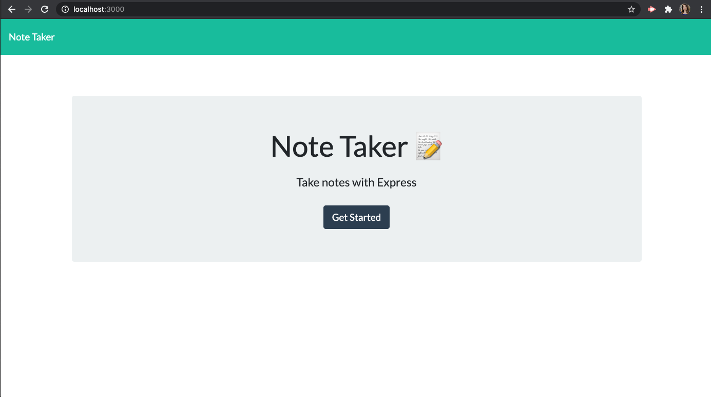
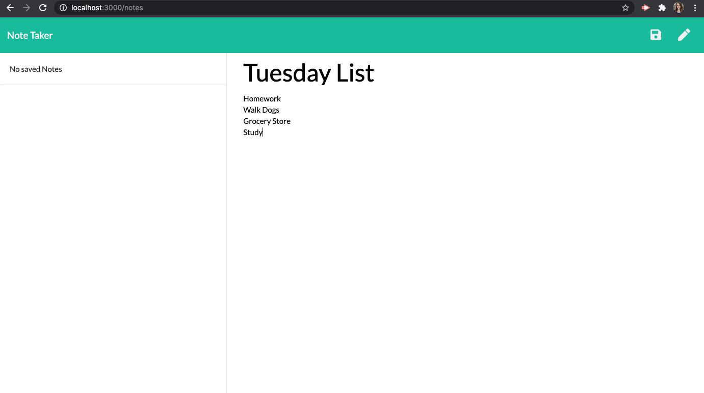
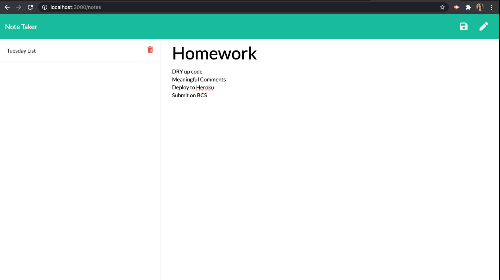

# Note Taker

## Description
This application can be used to write, save, and delete notes. The application uses a Express backend server to save and retrieve note data from a JSON file. The developer used the GET, POST, and DELETE methods to accomplish the basic functionality. The user will be able to take persistent notes by accessing the application on Heroku. 

## Table of Contents

* [Installation](#Installation)
* [Usage](#Usage)
* [Contributing](#Contributing)
* [License](#License)

## Installation

1. Navigate to the Github repo for the [Note Taker](https://github.com/mollymccollumwx/note-taker) and fork the repository. 
2. Copy the SSH key in the green "Code" button.
3. Clone the repo in your terminal.
4. Run `npm install` (make sure you have node.js installed first) to install the dependencies.
5. Run `npm start` in your terminal to start the express server. 

## Usage
The layout and functionality of the application is simple. Type a note title and note contents and hit the save button. 

The saved note will appear in the list on the left side of the page. 

Once a note has been saved, the user has the option to delete it using the trash can icon next to the list title. 

## Contributing

This webpage was created during the Georgia Tech Coding Bootcamp. Thanks to the TA's and classmates that gave advice on approaching and fixing problems in the code. 

## License
MIT License

Copyright (c) [2021] [Molly McCollum]

Permission is hereby granted, free of charge, to any person obtaining a copy of this software and associated documentation files (the "Software"), to deal in the Software without restriction, including without limitation the rights to use, copy, modify, merge, publish, distribute, sublicense, and/or sell copies of the Software, and to permit persons to whom the Software is furnished to do so, subject to the following conditions:

The above copyright notice and this permission notice shall be included in all copies or substantial portions of the Software.

THE SOFTWARE IS PROVIDED "AS IS", WITHOUT WARRANTY OF ANY KIND, EXPRESS OR IMPLIED, INCLUDING BUT NOT LIMITED TO THE WARRANTIES OF MERCHANTABILITY, FITNESS FOR A PARTICULAR PURPOSE AND NONINFRINGEMENT. IN NO EVENT SHALL THE AUTHORS OR COPYRIGHT HOLDERS BE LIABLE FOR ANY CLAIM, DAMAGES OR OTHER LIABILITY, WHETHER IN AN ACTION OF CONTRACT, TORT OR OTHERWISE, ARISING FROM, OUT OF OR IN CONNECTION WITH THE SOFTWARE OR THE USE OR OTHER DEALINGS IN THE SOFTWARE.

